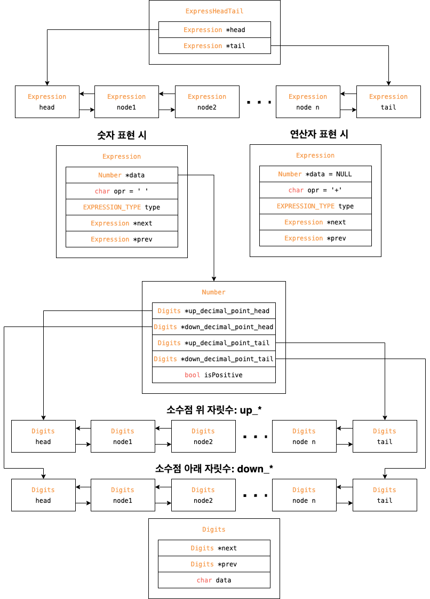

# 무한소수 계산기

## 실행

### 컴파일

makefile 실행

```shell
make
```
make가 오류가 날 때
```shell
gcc -o main.out main.c include/input.c include/express/number.c include/error.c include/express/stack.c include/calculator.c
```
### 실행
```shell
./main.out
```

### 입력 식 수정하기
input 파일에서 식을 수정하면 됩니다.

## 기능

### 입력

1. input 파일로 부터 계산 식 읽어오기
   * 이때 문자열의 길이 제한 x -> 동적할당을 위해 **연결 리스트**로 구현
2. 입력에 대한 예외처리 필수
   * 0-9, (), *, +, - 이외의 입력
   * 괄호의 갯수가 다를때
   * 소숫점의 개수가 2개 이상일 때
3. 곱하기 기호 생략의 예외 처리 (ex. 2(3+2) = 2*(3+2))

### 계산

1. 수식 표기법을 중위표기법에서 후위표기법으로 변환
   * **스택**을 이용
2. 덧셈/곱셈/뺄셈 함수 구현. 나눗셈은 필수는 아님
   * **연산의 정확도**가 평가 기준

## 아이디어

* 숫자 표현은 소숫점 자릿수, 일반 자릿수 따로 표현하기

## 구현 사항

### 1차 구현

파일에서 식 입력 받고 입력 된 식 링크드 리스트로 읽어오기, 식 오류 검출하기. 입력된 식 후위 연산자로 변환하기

#### 파일에서 식 입력 받아 링크드 리스트로 변환

##### 관련 파일

* [include/input.c](#includeinputc)
* include/express/number.c

##### 사용된 기술

* 구조체
* 이중 링크드 리스트
* 포인터
* 열거형(enum)

#### 식 오류 검출하기

##### 관련 파일

* include/error.c

##### 사용된 기술

* 열거형(enum)

#### 입력된 식 후위 연산자로 변환하기

##### 관련 파일

* include/express/numbr.c
* include/express/stack.c

##### 사용된 기술

* 구조체
* 이중 링크드 리스트
* 포인터
* 열거형(enum)

### 2차 구현

더하기, 빼기, 곱하기 연산. 나누기는 시간에 따라 구현 or 버림.

### 파일 설명

자세한 설은 파일에 있는 주석 참고

#### main.c

메인

#### include/input.c

식 파일 입력과 링크드 리스트로 변환에 관여하는 파일

#### include/error.c

오류가 어떤 타입인지 출력하는 파일

##### 에러 타입 종류 설명

1. **ERROR_INVALID_CHARACTER** - 숫자, +, -, *, () 이외의 문자가 입력되는 경우
2. **ERROR_FILE_IO** -식 파일을 읽어올 수 없는 경우
3. **ERROR_TOO_MANY_DECIMAL_POINT** - 한 숫자에 소수점이 두 개 이상일 경우
4. **ERROR_TOO_MANY_OPERATOR** - 한번에 너무 많은 연산자가 존재할 경우
5. **ERROR_OPERATOR_WRONG_ORDER** - 연산자가 잘못 된 순서로 존재할 경우
6. **ERROR_TOO_MANY_OPERATOR_BEFORE_BRACKET** - ( 직전에 2~3개 이상의 연산자가 존재할 경우
7. **ERROR_RIGHT_BRACKET_WRONG_POSITION** - ) 가 식의 맨 앞에 나오는 경우
8. **ERROR_RIGHT_BRACKET_AFTER_OPERATOR** - ) 앞에 연산자가 하나라도 존재하는 경우
9. **ERROR_MUTIPLE_OPERATOR_WRONG_POSITION** - 곱하기 기호가 식의 맨 앞부분, ( 바로 뒤, 맨 마지막 부분에 존재하는 경우
10. **ERROR_OPERATOR_FIRST_ERROR** - 식의 맨 앞이나 ( 바로 뒤에 있는 ( 기호 앞에는 하나의 연산자 (+, -) 만 나올 수 있음. * 기호나 여러 연산자가 나올 경우 오류 처리
11. **ERROR_NOTHING_IN_BRACKETS** - 괄호 안에 아무것도 없는 경우
12. **ERROR_BRACKERS_COUNT_NOT_SAME** - (와 )의 개수가 다른 경우
13. **ERROR_RIGHT_BRACKET_FRIST** - ) 가 ( 보다 먼저 나올 경우 오류 처리

#### include/express/number.c

식과 숫자를 표현하는 구조체와 링크드 리스트를 정의하고 추가, 삭제 등 기능을 구현한 파일

##### 식 표현 구조체 설명



#### include/express/stack.c

스택을 구현하고 후위 연산식 변환 기능을 구현한 파일

## 평가 기준

연산의 정확도. 3가지 항목으로 평가

1. 결과의 정확도 (오차)
2. 괄호 처리 여부, 입력의 다양성, 예외처리 등
3. 나눗셈 구현 시 추가 점수

