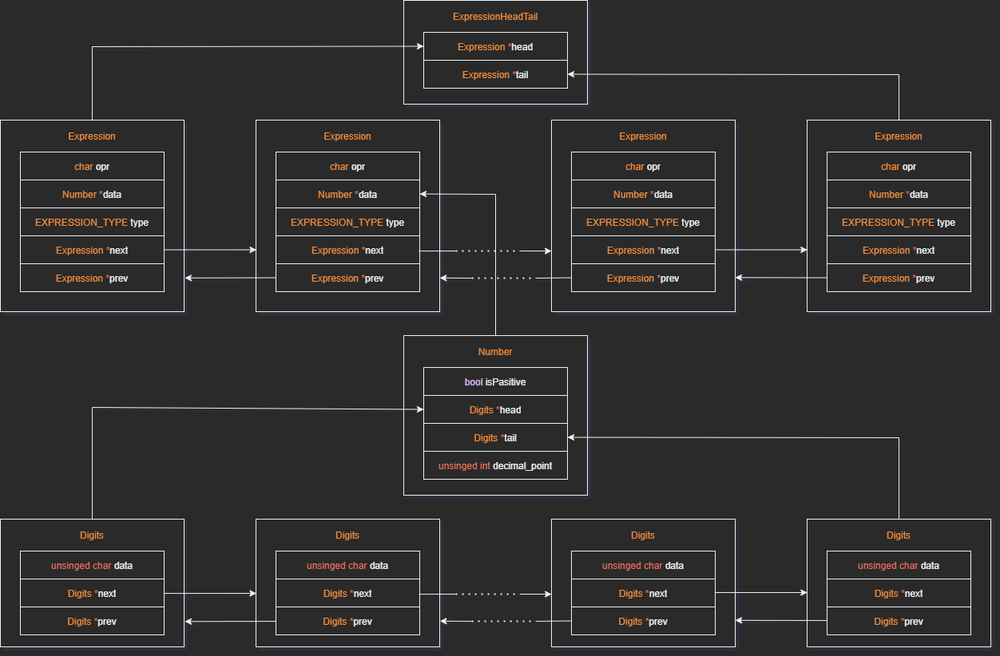
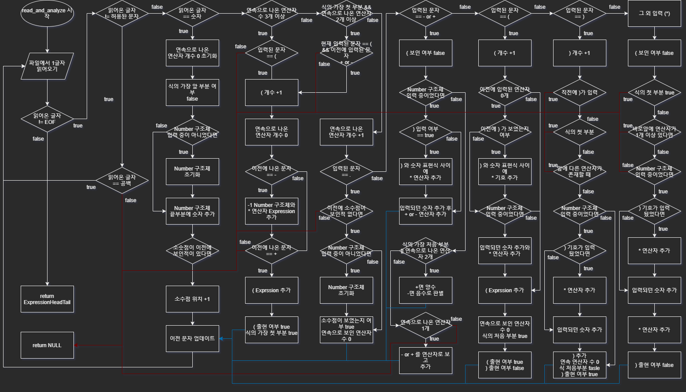
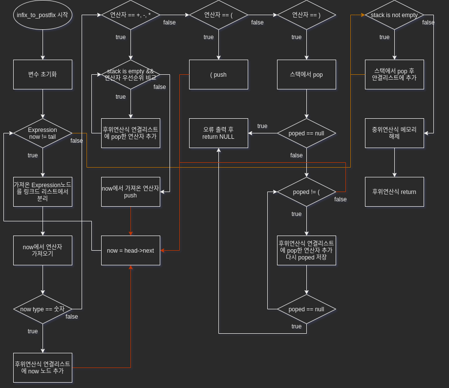

# 무한소수 계산기

## 실행

### 컴파일

첫 번째 방법 - makefile 실행

```shell
make
```
두 번째 방법 - make가 오류가 날 때
```shell
gcc -o main.out main.c include/input.c include/express/number.c include/error.c include/express/stack.c include/calculator.c
```
### 실행
```shell
./main.exe
```

### 입력 식 수정하기
input 파일에서 식을 수정하면 됩니다.

## 요구 사항

### 프로그램 정의

무한소수: 소수점 아래 0이 아닌 수가 무한히 많은 소수.

숫자 길이에 제한 없이 계산이 가능해야 함.

### 주요 기능

1. 자릿수에 제한이 없음
2. 식 읽어오기
3. 입력된 식 후위연산식으로 변경
4. 덧셈, 뺄셈, 곱셈 연산 가능
4. 에러 처리

### 구현 방법

#### 1. 자릿수 제한

* 문제점

  * 숫자를 표현하는 int, float, double형 모두 표현 가능한 범위 존재.
  * 표현 가능한 수의 범위가 무한해야하는 계산기 특성상 새로운 방법으로 수를 표현해야 함.

* 해결방법

  * 수를 표현할 새로운 자료형 만들기

* 구현 방법

  * 구조체와 연결리스트를 이용해 새로운 표현 방법 구현.

    

  * Digits: 한 자리수 씩 숫자를 char 형태로 저장하는 구조체. Digits 자신의 앞, 뒤 노드를 가르킬 수 있는 포인터 변수를 이용해 **이중연결리스트** 형태로 저장됨. 연결리스트의 가장 앞 노드와 가장 뒤 노드는 데이터를 저장하지 않고 위치 판별을 위해서만 쓰임.

  * Number: 하나의 수를 저장하고 표현하는 **Digits 이중연결리스트의 가장 앞 노드와 가장 끝 노드의 포인터, 소수점의 위치, 양수인지 여부를 저장**하는 구조체. 소수점 위치는 Digits의 어느 지점에 존재하는지 숫자로 표현.

  * Expression: 숫자와 연산자를 저장하는 구조체. EXPRESSION_TYPE을 이용해 숫자인지 연산자인지 구분. 만약 숫자면 Number 포인터 변수로 수를 저장하고, 연ㅅ간자면 opr을 char형으로 저장. Expression도 자신의 앞, 뒤 노드를 가르킬 수 있는 포인터 변수를 이용해 **이중연결리스트** 형태로 저장하여 하나의 계산 식을 표현. 연결리스트의 가장 앞 노드와 가장 뒤 노드는 데이터를 저장하지 않고 위치 판별을 위해서만 쓰임.

  * ExpressHeadTail: 식을 저장하고 표현하는 **Expression 이중연결리스트의 가장 앞 노드와 가장 끝 노드의 포인터를 저장하는 구조체.**

* 관련 c 파일

  * /include/express/number.c
  * /include/express/number.h

#### 2. 식 읽어오기

* 문제점

  * 계산할 식을 input파일을 통해 입력받아 계산.
  * 일반적으로 읽어서 int, float, double 형으로 변환하는 방법은 사용 불가

* 해결방법

  * 한 글자씩 읽어오며 읽어온 문자에 따라 저장

* 구현 방법

  * 파일을 읽어오고 식을 저장하는 과정

    

  * 자세한건 주석과 위의 플로우 차트 참고

* 관련 파일

  * /include/input.c
  * /include/input.h

#### 3. 입력된 식 후위연산식으로 변경

* 문제점
  * 중위 연산식은 앞에서 부터 순서대로 계산하면 계산 순서가 바뀜
  
* 해결방법
  * 후위연산식으로 바꿔 앞에서 부터 계산 하더라도 우선순위가 지켜지도록 구현
  
* 구현 방법

  * 스택을 이용해 후위 연산식으로 변환

    

  * 자세한건 주석과 위의 플로우 차트 참고

  * 알고리즘 동작 자체는 실습 시간에 배운 알고리즘과 같음

* 관련 파일

  * /include/stack.c
  * /include/stack.h


#### 4. 연산 기능

* 문제점
  * 숫자를 표현하는 방법이 c 언어에서 제공하는 자료형이 아니라서 +, -, *와 같은 연산자 사용이 불가능.
* 해결방법
  * 입력되는 수와 연산자를 직접 구현
* 구현 방법

#### 5. 오류 처리

식 자체에 많은 오류가 존재할 수 있음.

* 오류 종류
  * ERROR_INVALID_CHARACTER: 허용되지 않은 문자가 있는 오류. 허용된 문자는 0-9, ()+*-.
  * ERROR_FILE_IO: 파일을 읽어올 수 없는 오류
  * ERROR_TOO_MANY_DECIMAL_POINT: 한 숫자 표현에 소수점이 두번 이상 나오는 경우
  * ERROR_TOO_MANY_OPERATOR: 한번에 연속으로 연산자가 적절한 개수보다 더 많이 나올 경우
  * ERROR_OPERATOR_WRONG_ORDER: 연산자 순서가 틀리게 나오는 경우
  * ERROR_TOO_MANY_OPERATOR_BEFORE_BRACKET: ( 직전에 연산자가 2개 이상 존재하는 경우
  * ERROR_RIGHT_BRACKET_WRONG_POSITION: ) 가 적절하지 않은 위치에 있는 경우
  * ERROR_RIGHT_BRACKET_AFTER_OPERATOR: ) 앞에 연산자가 존재하는 경우
  * ERROR_MUTIPLE_OPERATOR_WRONG_POSITION: * 연산자가 식의 시작/끝 부분에 위치하는 경우
  * ERROR_OPERATOR_FIRST_ERROR: 식의 첫 부분에서 2개 이상의 연산자가 존재하는 경우
  * ERROR_NOTHING_IN_BRACKETS: () 안에 아무 숫자, 표현도 없는 경우
  * ERROR_BRACKERS_COUNT_NOT_SAME: (와 )가 개수가 서로 다른 경우
  * ERROR_RIGHT_BRACKET_FRIST: 후위변환 과정에서 스택에 (가 없는데 )가 나온 경우
  * ERROR_CALCULATION_ERROR: 계산 과정에서 오류가 생긴 경우
* 구현 방법
  * 열거형을 이용해서 정의
* 관련 파일
  * /include/error.h
  * /include/error.c
